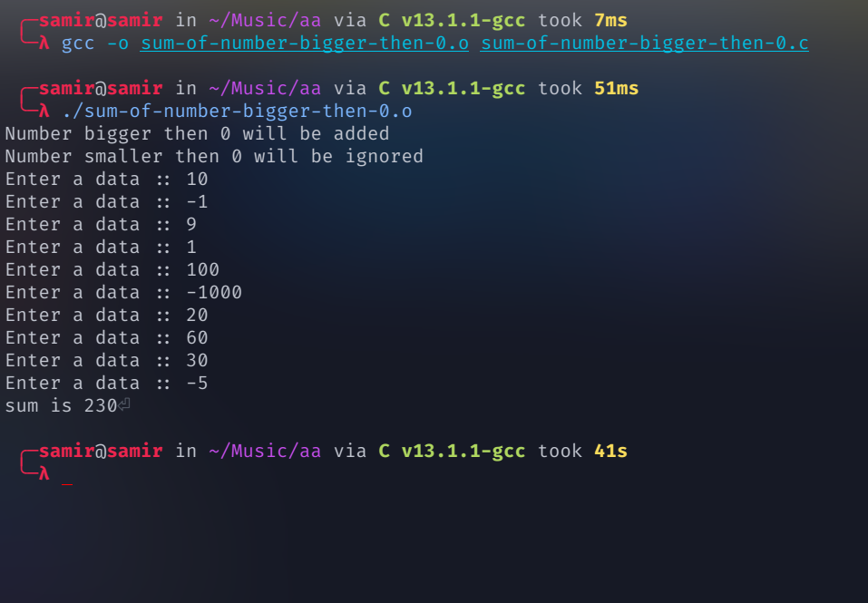

# sum-of-number-bigger-then-0
Find sum-of-number-bigger-then-0


compile  c file 

```
 gcc -o sum-of-number-bigger-then-0.o sum-of-number-bigger-then-0.c
```

Run file 
```
./sum-of-number-bigger-then-0.o
```



##

[](https://github.com/samirgaire10)

[](https://github.com/samirgaire10)


## 🚀 About Me

- 👨‍💻 My Github is available at [Github](https://github.com/samirgaire10)
- 👨‍💻 My Portfolio is available at [Portfolio](https://samirgaire10.github.io/Portfolio/)
- 👨‍💻 My projects  Library are available at [Library](https://samirgaire10.github.io/Library/)
- 👨‍💻 My Highschool projects are available at [HighSchool projects](https://samirgaire10.github.io/High-School-Web-Projects/)
- 👨‍💻 My Kamata projects are available at [ 日本工学院専門学校蒲田 projects](https://samirgaire10.github.io/kamata/)
- 👨‍💻 My Linux projects are available at [ Linux projects](https://samirgaire10.github.io/linux/)

